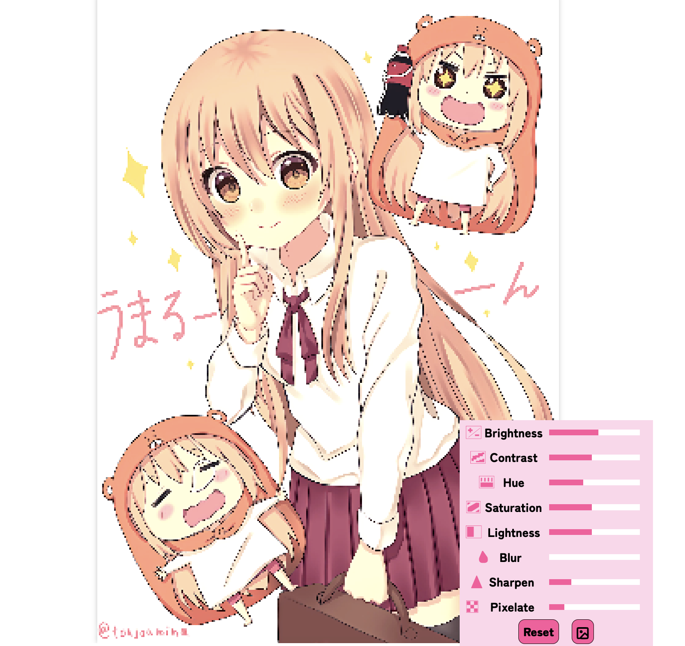

# Moepictures

Moepictures is an image board site for cute anime art, organized by tags.


### Searching With Spaces

Moepictures's tags use the dash ("-") as the delimeter, but the search can guess what tags you are looking for even if you use spaces.

### Multiple Images Per Post

Moepictures supports multiple images per post, which is great for comics and posts with lots of variations. We also have parent/child relationships and groups.

### Image Filters



You can apply image filters such as brightness, contrast, and hue in realtime. There is also a very fun pixelate filter that 
can make everything look like a pixel game. When playing audio, the pixelate filter will work as a bitcrusher.

### Custom Players

Moepictures uses custom gif/video/music/3d/live2d players, so you can do many things that aren't normally possible like pausing/seeking 
gifs, reverse playback, and modification of playback speed. 

### Notes


As often images might contain japanese text, adding and viewing notes for translations is also supported!

### Self-hosting

Make sure that you install the correct major version of our dependencies. Using newer major versions is likely to have breaking changes. 

- Node.js v23: https://nodejs.org/en/
- Python v3.11: https://www.python.org/
- PostgreSQL v16: https://www.postgresql.org/

Clone the project:
```
git clone https://github.com/Moebytes/Moepictures.git
```

Rename the file `.env.example` to `.env` and put in your credentials. At minimum the pg database credentials are required, which are the keys prefixed with `PG`. `COOKIE_SECRET` should be set to a string of random characters. `EMAIL_ADDRESS` and `EMAIL_PASSWORD` is the email address used to send people email verification emails, password resets, etc. For it to work with gmail, you need to setup an app password: https://myaccount.google.com/apppasswords 

In order for source lookup from Pixiv, Twitter, and other sites to work, you need to seek out the credentials for their respective API's. You can find info on how to obtain them simply by googling, it would take me a long time to detail every site.

To add files locally create folders "moepictures" and "moepictures-unverified" and add the path to `MOEPICTURES_LOCAL` and `MOEPICTURES_LOCAL_UNVERIFIED`, each containing the following subfolders:

`["image", "comic", "animation", "video", "audio", "model", "live2d", "artist", "character", "series", "tag", "pfp", "thumbnail"]`

If you want to upload upscaled files you also need to make their respective upscaled folders:

`["image-upscaled", "comic-upscaled", "animation-upscaled", "video-upscaled"]`

The site runs on port 8082 by default but it can be configured by changing `PORT`.

#### Compiling Node.js

Install all of the dependencies for this project by running `npm install`. \
Start the project by running the server `npm start`.

#### Python Scripts
Some features like the auto tagger are done by a python script. The scripts try to install the dependencies if they aren't found, but if you 
have issues running them you can try installing the dependencies manually.

```py
pip3 install pandas torch torchvision numpy Pillow timm opencv-python manga-ocr text-detector translate pyclipper shapely --compile --force-reinstall
```

#### Live2D Support
To enable live2d support, you need to download the Cubism Core web sdk and place it in `assets/live2d`.
https://www.live2d.com/en/sdk/download/web/

That's pretty much it. Following our license (CC BY-NC 4.0) you may not commercialize self-hosted instances.


