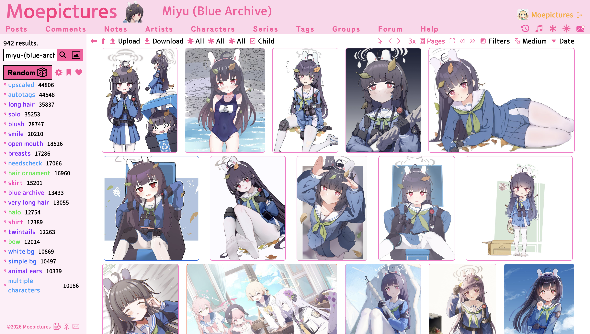

# Moepictures

Moepictures is a website for posting cute anime artworks.



### Search With Spaces

Tags use the dash ("-") as the delimeter, but the search can guess what tags you are looking for even if you use spaces.

### Multiple Images Per Post

A post can have multiple images, called variations. There are also child and group relationships.

### Image Filters

You can add image filters such as brightness, contrast, hue, and pixelate. There are also audio filters such as highpass, 
lowpass, and bitcrush.

### Notes


Since images might contain non-english text, adding notes for translations is supported! Apart from appearing in a bubble, 
notes may also be overlayed on the image with some styling. Notes can also be used to "mark" a character in images with multiple characters.

### Tag Groups

Tags support custom grouping, useful to separate each characters specific tags in images with multiple characters. The syntax is 
`Character-1{tag-1 tag-2 tag-3} Character-2{tag-1 tag-2 tag-3}`. 

### MoeText

MoeText is our custom language used to format styling in comments and replies. It also handles linking to items such as posts. 
See https://moepictures.net/help#commenting for the list of formatting replacements. 

### Design

Our design is available here: https://www.figma.com/design/f7fQmrcMwfKOGYUnHnXZ0B/Moepictures-Website 

### Self-hosting

Make sure that you install the correct major version of our dependencies. Using newer major versions is likely to have breaking changes. 

- Node.js v23: https://nodejs.org/en/
- Python v3.11: https://www.python.org/
- PostgreSQL v16: https://www.postgresql.org/
- Redis v7: https://redis.io/

Clone the project:
```
git clone https://github.com/Moebytes/Moepictures.git
```

Rename the file `.env.example` to `.env` and put in your credentials. At minimum the pg database credentials are required, which are the keys `PG_HOST`, `PG_USER`, `PG_DATABASE`, `PG_PASSWORD`, `PG_PORT`, and the `COOKIE_SECRET` which should be set to a string of random characters. 

`EMAIL_ADDRESS` and `EMAIL_PASSWORD` is the email address used to send people email verification emails, password resets, etc. Set `EMAIL_VERIFICATION` to yes to enable it. For it to work with gmail, you need to create an app password: https://myaccount.google.com/apppasswords 

In order for source lookup from Pixiv, Twitter, and other sites to work, you need to seek out the credentials for their respective API's. You can find info on how to obtain them simply by googling, it would take me a long time to detail every site. 

To upload files locally create folders "moepictures" and "moepictures-unverified" and add the path to `MOEPICTURES_LOCAL` and `MOEPICTURES_LOCAL_UNVERIFIED`. 

To upload files remotely we use any S3-compatible object storage. Fill out the S3 relevant credentials as well as `MOEPICTURES_BUCKET` and `MOEPICTURES_BUCKET_UNVERIFIED`. 

Rename the files `structures/Decryption.example.ts` to `structures/Decryption.ts` and `structures/Encryption.example.ts` to `structures/Encryption.ts`. They do nothing unless you implement them apart from making the project compile.

#### Compiling Node.js

Install all of the dependencies for this project by running `npm install`. \
Start the project by running the server `npm start`.

The site runs on http://localhost:8082 by default, but the port can be configured by changing `PORT`.

#### Python Scripts
Some features like the auto tagger are done by a python script. The scripts try to install the dependencies if they aren't found, but if you have issues running them you can try installing the dependencies manually.

```py
pip3 install pandas torch torchvision numpy scipy Pillow timm opencv-python manga-ocr text-detector translate pyclipper shapely pytorch_lightning einops transformers safetensors onnxruntime --compile --force-reinstall
```

#### Live2D Support
To enable live2d support, you need to download the Cubism Core web sdk and place it in `assets/live2d`.
https://www.live2d.com/en/sdk/download/web/

#### A Note on Updating
Because I am a solo developer, there is no system provided for database schema and data migrations, since it's 
mainly a hassle for me. You update at your own risk and handle changes manually. You can check the file 
`sql/CreateDB.sql` to see if anything changed. 

That's pretty much it. Following our license (CC BY-NC 4.0) you may not commercialize self-hosted instances.


